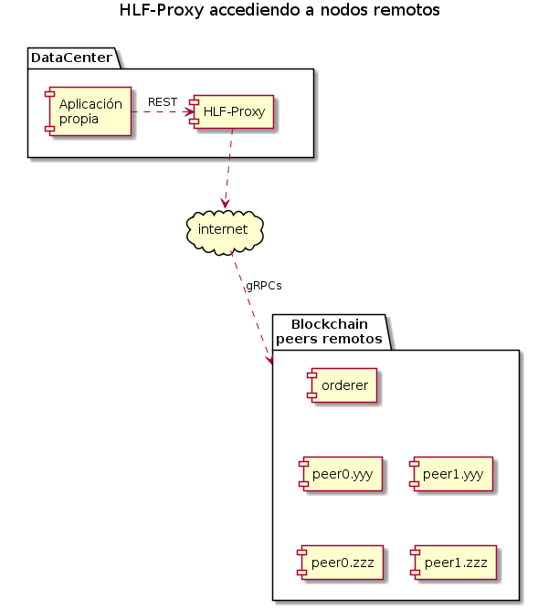
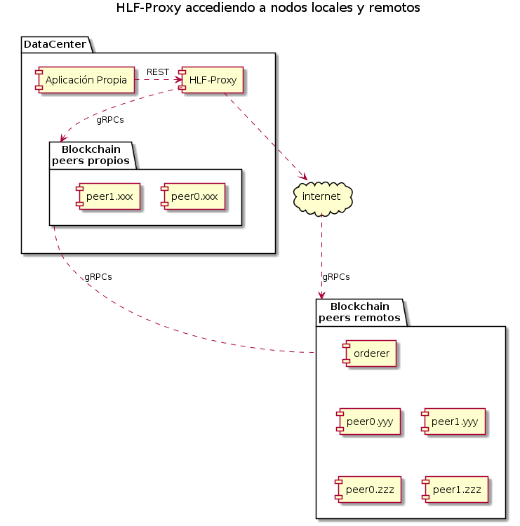

# HLF-Proxy

Aplicación que expone endpoints REST que permiten invocar las funciones de los chaincodes de negocio (ejemplo padfedcc) y del Query System Chaincode [QSCC](https://github.com/hyperledger/fabric/tree/master/core/scc/qscc) en una red de Blockchain [Hyperledger Fabric 1.4](https://hyperledger-fabric.readthedocs.io/en/release-1.4/index.html).

Provee una Swagger UI que atiende en [FQDN]:[port configurado en application.conf]/swagger#/

## Esquemas de deploy

Una organización autorizada a acceder a la Blockchain que no corre nodos de la red, puede utilizar HLF-Proxy para invocar via REST las funciones del chaincode. HLF-Proxy se conecta mediante internet a los nodos de la red. 



Una organización que corre nodos de la Blockchain, puede utilizar un HLF-Proxy conectado a sus propios peers para tener mejor tiempo de respuesta en consultas.

Para la actualizar la Blockchain requiere que HLF-Proxy este conectado mediante internet al orderer y a los peers remotos de otras organzasiones. 



---

## Endpoints

Endpoints | Método | Acción
--- | --- | ---
/hlfproxy/api/v1/query/{channel}/{cc}[/{peer}][?{params}]| POST | Invoca funciones del chaincode {cc} en el channel {channel} en el PEER {peer} o en los PEERs configurados en el **xxx.client.yaml** con `chaincodeQuery:true`. No envía la tx a los ORDERERs.
/hlfproxy/api/v1/invoke/{channel}/{cc}[/{peer}][?{params}]  | POST | Invoca funciones del chaincode {cc} en el channel {channel} en el PEER {peer} o en los PEERs configurados en el **xxx.client.yaml** con `endorsingPeer:true`.  Envia la tx al ORDERERs. 
/hlfproxy/api/v1/ledger/blockheight/{channel}/{peer} | GET | Recupera el número de bloque mas reciente o el mas alto desde el PEER {peer} o desde los PEERs configurados en el **xxx.client.yaml** con `ledgerQuery:true`.  

Params | Endpoints | Descripción | Default  
--- | --- | --- | ---
waitForEventSeconds=n  | invoke | Tiempo en segundos que debe esperar por el evento de validación de la tx. Para que la espera funcione debe configurarse un único PEER en el archivo  **xxx.client.yaml**  con `eventSource:true`.| Valor configurado en el **application.conf** property ``fabric.waitForEventSeconds``. 
verbose=[true o false] | query e invoke | true: agrega mas información en el json del response. | false  

**ejemplo:**

```
http://dominio:8085/hlfproxy/api/v1/invoke/padfedchannel/padfedcc?waitForEventSeconds=100&verbose=true
```
### query e  invoke: Body del Request

**Content-type:** `application/json`

El body del request debe ser un json object con la siguientes estructura:

Campo| Descripción
--- | --- 
function | String conteniendo el nombre de la función del chaincode.
Args  | Json array con los parámetros que recibe la función del chaincode.

Ej: invoke a la function "getPersona" que recibe como argumento una cuit.
``` json
{"function":"getPersona","Args":[20104249729]}
``` 
### HTTP Status Code

Basado en [List of HTTP status codes](https://en.wikipedia.org/wiki/List_of_HTTP_status_codes)

Valor | Nombre | Descripción
--- | --- | ---
200 | OK (VALID)   | quey ok o tx invoke avalada por los Peers y validada por los Committers (actualizó el State).
202 | ACCEPTED  | Tx invoke avalada por los Peers y procesada por el Orderer. Se desconoce si fue validada por los Committers.
400 | BAD REQUEST| Error atribuible al cliente.
403 | FORBIDDEN  | El cliente intentó ejecutar una función del chaincode para la cual no tiene privilegios. 
404 | NOT FOUND  | El cliente mediante una funcion get intentó obtener un registro inexistente.
409 | CONFLICT | Tx invoke avalada por los Peers pero posteriormente invalidada por los Committers. La tx fue agregada en un bloque pero quedó marcada como inválida. No actualizó el State. [Ver txflow](https://hyperledger-fabric.readthedocs.io/en/release-1.4/txflow.html)
500 | INTERNAL SERVER ERROR | Error interno del sistema.
501 | NOT IMPLEMENTED | El cliente invoco una función inexistente.

### query e invoke: Response

**Content-type:** `application/json`

El body del response contiene un json object con la siguiente estructura:

(se considera SUCCESS cuando txStatus es VALID o ACCEPTED)

Campo        | SUCCESS verbose=false | SUCCESS verbose=true| ERROR | Desc
---          | --- | --- | --- | ---
status       | X | X | X | [Ver HTTP Status Code]
block        | X | X | X | Numero de bloque en que quedó incluida la tx. Solo se informa cuando el proxy espera por el evento de validación de la tx `waitForEventSeconds>0`
txId         | X | X | X | id de la tx fabric
time         | X | X | X | timestamp UTC en formato `yyyy-MM-dd HH:mm:ss`, ej: `2018-07-23 14:31:56`
channel      |   | X | X | Nombre del channel
chaincode    |   | X | X | Nombre del chaincode
txStatus     |   | X | X | [Ver Campo txStatus]
step         |   |   | X | [Ver Campo step]
errMsg       |   |   | X | Mensaje de error generado en el step.
thread       |   | X | X | Nombre del thread que procesó la tx
client       |   | X | X | Integration api utilizada. Ej: `afip.bc.fabric.api`
simulatingMs |   | X | X | Milisegundos que demoró la simulación
ordererMs |   | X | X | Milisegundos que demoró el envió a los ORDERERs. Solo se informa cuando el proxy no se queda esperado el evento de validación de la tx.
eventMs      |   | X | X | Milisegundos que demoró el envió a los ORDERERs + el evento de validación de la tx
ccResponse   |   | X | X |[Ver Campo ccResponse]
peers        |   | X | X | Array de objetos peer
peer.name        |   | X | X | Nombre del peer. Ej: `peer0.xxx.com`
peer.url         |   | X | X | URL del peer incluyendo el port Ej: `peer0.xxx.com:7051`
peer.simulatingStatus |   | X | X | Resultado de la simulación ( SUCCESS o FAILURE ) 
peer.eventStatus |   | X | X | Resultado de la validación de los COMMITERs ( VALID, ENDORSEMENT_POLICY_FAILURE, MVCC_READ_CONFLICT, ...) [Ver lista de errores en peer.transaction.proto](https://github.com/hyperledger/fabric-sdk-java/blob/master/src/main/proto/peer/transaction.proto)
peer.errMsg |   |  | X | Mensaje de error

### Campo txStatus

Valor | Desc 
--- | --- 
REFUSED  | tx rechazada 
VALID    | tx avalada y validada exitosamente
INVALID  | tx avalada e invalidada por los COMMITTERs
ACCEPTED | tx procesada por el ORDERER, pero se desconoce si fue validada por los COMMITTERs
UNKNOW   | tx respaldada por los PEERs, pero se desconoce si fue procesada por el ORDERER
PANIC  | tx procesada por el ORDERER, pero algunos COMMITTERs la validaron y otros la invalidaron (por ahora este error no es detectado por el proxy)

### Campo step

Step del flujo de la tx donde ocurrió el error.

Valor | Desc
--- | ---
VALIDATING_REQUEST      | Error validando el request del cliente. 
CREATING_TX             | Error construyendo la tx fabric.
SENDING_TX_TO_PEER      | Ningún PEER pudo ser invocado (timeout, handshake TLS, etc). 
SIMULATING_TX           | Error detectado por el chaincode.
PROCESSING_ENDORSEMENTS | Error procesando las respuestas de los PEERs. Ej. las respuesta obtenidas son distintas.
SENDING_TO_ORDERER      | Error enviando la tx al ORDERER 
WAITING_FOR_EVENT       | Error esperando la validación de la tx (timeout) 
VALIDATING_TX           | Error detectado en la validación de la tx. Ej: ENDORSEMENT_POLICY_FAILURE, MVCC_READ_CONFLICT, PHANTOM_READ_CONFLICT, ... [Ver lista de errores en transaction.proto](https://github.com/hyperledger/fabric-sdk-java/blob/master/src/main/proto/peer/transaction.proto)

### Campo ccResponse

Campo String que contiene el payload de la respuesta del chaincode.   
Al ser un campo String los delimitadores `"` quedan escapeados.

En caso de txs tipo query, el resultado debe recuperarse desde este campo.
Tipicamente las funciones queries del chaincode **padfedcc** generan un json array de pares {Key-Record}. 
Ejemplo:

``` json
{"function":"queryPersona","Args":[20104249729]}
``` 

``` json
{
  "txId": "75c271b6604c8ce7cc280cc35d3c03e90a412a83238dba3666eb973f08ab3555",
  "time": "2019-06-11 23:45:12",
  "status": 200,
  "ccResponse": "[{\"Key\":\"per:20104249729#per\",\"Record\":{\"tipo\":\"F\",\"id\":20104249729,\"tipoid\":\"C\",\"estado\":\"A\",\"nombre\":\"XXXXXXXXXXXX\",\"apellido\":\"XXXXXXXX\",\"materno\":\"XXXXXXX\",\"sexo\":\"M\",\"documento\":{\"tipo\":96,\"numero\":\"XXXXXXXX\"},\"nacimiento\":\"1952-05-25\"}}]"
}
```
## Como correr la aplicación

HLF-Proxy esta disponible como imgen docker.

Para correr la aplicacion se requiere que el equipo tenga instalado:
- DOCKER 18.09 o superior	
- DOCKER-COMPOSE 1.23.1 o superior

La imagen se puede obtener mediante `docker pull`

``` sh
$ docker pull padfed/bc-proxy:latest
```
#### Opción 1 - Ejecución mediante docker run

``` sh
$ docker run --rm --tmpfs /tmp:exec --name hlf-proxy -d -v ${PWD}/conf:/conf -p 8085:8085 padfed/bc-proxy:latest
```
#### Opción 2 - Ejecución mediante docker-compose

Archivo `docker-comnpose.yaml`

``` sh
version: '3.5'

networks:
  hlf-proxy:
    name: hlf-proxy-network

services:
  hlf-proxy:
    labels:
      app: hlf-proxy
    container_name: hlf-proxy
    image: padfed/bc-proxy:latest
#    read_only: true
#    environment:
#      - TZ=America/Argentina/Buenos_Aires
    ports:
      - 8085:8085
    tmpfs: /tmp:exec
    volumes:
       - "./conf:/conf"
    networks:
      - hlf-proxy
```

``` sh
$ docker-compose up
```
## Requerimientos de networking

Acceso por protocolo gRPC sobre TLS  a los nodos peers y orderer configurados en xxx.client.yaml:

## Archivos requeridos

Archivo | Descripción | Ubicación
--- | ---| ---
application.conf | Archivo de configuración de la aplicación |  ${PWD}/conf/
xxx.client.yaml | Archivo que describe la red | Indicada en application.conf.
userX.orgX.msp-pk.pem |  Archivo en formato PEM conteniendo la clave privada de la aplicación para MSP.| Indicada en application.conf.
userX.orgX.msp-cert.pem |  Archivo en formato PEM conteniendo el certificado X509 de la aplicación para MSP, emitido por la MSP-Root-CA de la org a la que pertenece. Debe tener OU=client en el Subject. | Indicada en application.conf.
orgX.tls-root-ca.pem | Archivos en formato PEM conteniendo los certificados X509 de las TLS-Root-CAs de las orgs que corren Orderers y/o Peers | Indicadas en xxx.client.yaml.

###  application.conf

```
application.port=8085

##FABRIC conf
fabric.waitForEventSeconds=5
fabric.yaml.conf=./conf/blockchain-tributaria.testnet.client.yaml

fabric.auth.type=fs
fabric.auth.appuser.name=User1
certificate.check.restrict=false
fabric.auth.appuser.keystore.path=/conf/store/xxx/userX.orgX.msp-pk.pem
fabric.auth.appuser.certsign.path=/conf/store/xxx/userX.orgX.msp-cert.pem
fabric.tls.auth.appuser.keystore.path= /conf/store/xxx/userX.orgX.tls-pk.pem
fabric.tls.auth.appuser.certsign.path= /conf/store/xxx/userX.orgX.tls-cert.crt

netty {
  #server.threads.Max default --> Math.max(32, availableProcessors * 8)
  #overwrite like system property --> -Dserver.threads.Max
  workerThreads = ${server.threads.Max}
}

server {
  business.thread.timeout.seconds=10
}

fabric {
  netty {
    grpc {
      //keyAliveTime in Minutes
      NettyChannelBuilderOption.keepAliveTime="5"
      //keepAliveTimeout in Seconds
      NettyChannelBuilderOption.keepAliveTimeout="8"
      NettyChannelBuilderOption.keepAliveWithoutCalls="true"
      //maxInboundMessageSize in bytes
      NettyChannelBuilderOption.maxInboundMessageSize="10748894"
    }
  }

  sdk {
    peer.retry_wait_time = "5000"
  }
}

swagger {
  schemes: ["http","https"]
}
```
### xxx.client.yaml

En este ejemplo el proxy queda configurado para 
- enviar las txs tipo invoke a todos los PEERs declarados (`endorsingPeer: true`)
- enviar las txs tipo query solamente al peer0 de XXX (`chaincodeQuery: true`) 
- recuperar los eventos de validación de txs desde el peer0 de XXX (`eventSource: true`)
- recuperar info del ledger desde el peer0 de XXX (`ledgerQuery: true`)

``` yaml
name: "Network"
version: "1.0"
x-loggingLevel: trace

client:
  # organization: XXX | YYY| ZZZ | MULTIORGS
  organization: XXX
  logging:
    level: info
  eventService:
    timeout:
      connection: 5s
      registrationResponse: 5s

channels:
  padfedchannel:
    orderers:
      - orderer0.xxx.com

    peers:
      peer0.xxx.com:
        endorsingPeer: true
        chaincodeQuery: true
        ledgerQuery: true
        eventSource: true

      peer1.xxx.com:
        endorsingPeer: true
        chaincodeQuery: false
        ledgerQuery: false
        eventSource: false

      peer0.yyy.com:
        endorsingPeer: true
        chaincodeQuery: false
        ledgerQuery: false
        eventSource: false

      peer1.yyy.com:
        endorsingPeer: true
        chaincodeQuery: false
        ledgerQuery: false
        eventSource: false

      peer0.zzz.com:
        endorsingPeer: true
        chaincodeQuery: false
        ledgerQuery: false
        eventSource: false

      peer1.xxx.com:
        endorsingPeer: true
        chaincodeQuery: false
        ledgerQuery: false
        eventSource: false

organizations:
  XXX:
    mspid: XXX
    peers:
      - peer0.xxx.com
      - peer1.xxx.com

  YYY:
    mspid: YYY
    peers:
      - peer0.yyy.com
      - peer1.yyy.com

  ZZZ:
    mspid: ZZZ
    peers:
      - peer0.zzz.com
      - peer1.zzz.com

orderers:
  orderer0.ooo.com:
    url: grpcs://orderer0.ooo.com:7050
    tlsCACerts:
      path: conf/tls/orderer/orderer.tls-root-ca.pem

peers:
  peer0.xxx.com:
    url: grpcs://peer0.xxx.com:7051
    tlsCACerts:
      path: conf/tls/xxx/xxx.tls-root-ca.pem

  peer1.xxx.com:
    url: grpcs://peer0.xxx.com:7051
    tlsCACerts:
      path: conf/tls/xxx/xxx.tls-root-ca.pem

  peer0.yyy.com:
    url: grpcs://peer0.yyy.com:7051
    tlsCACerts:
      path: conf/tls/yyy/yyy.tls-root-ca.pem

  peer1.yyy.com:
    url: grpcs://peer0.yyy.com:7051
    tlsCACerts:
      path: conf/tls/yyy/yyy.tls-root-ca.pem

  peer0.zzz.com:
    url: grpcs://peer0.zzz.com:7051
    tlsCACerts:
      path: conf/tls/zzz/zzz.tls-root-ca.pem

  peer1.zzz.com:
    url: grpcs://peer0.zzz.com:7051
    tlsCACerts:
      path: conf/tls/zzz/zzz.tls-root-ca.pem

```

### Changelog
---

1.4.1

* Fix: NPE invocando funciones que responden sin message
* Fix: NPE reciviendo un error desde el chaincode cuando el request esta en modo verbose

1.4.0

 * Entrypoint de monitoreo `/metrics` compatible con [Prometheus](https://prometheus.io/)
